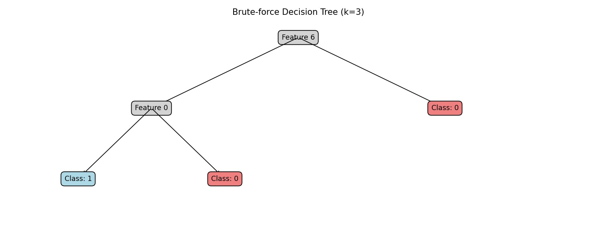
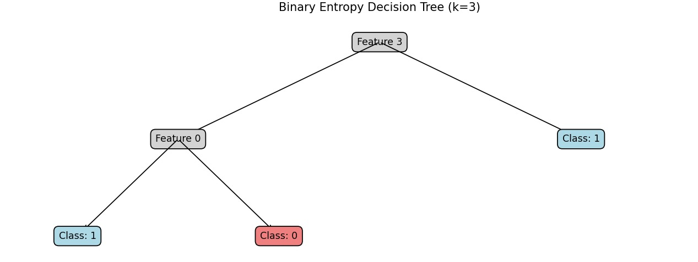

# Decision Tree Project

This project explores the implementation and comparison of decision tree algorithms for a binary classification task using a dataset of vectors.

## Overview

The project includes two main implementations of decision trees:
- **Optimized Brute Force Method**: A recursive approach with caching to build the decision tree by exploring all possible splits.
- **Binary Entropy Method**: A heuristic approach based on minimizing binary entropy to determine the best feature splits.

## Dataset

The dataset (`vectors.txt`) consists of binary vectors where each row represents a data point and the last column represents the class label (0 or 1).

## Implementation Details

### Requirements

- Python 3
- NumPy
- Matplotlib

### Running the Code

1. Ensure Python and required libraries are installed.
2. Clone this repository and navigate to the project directory.
3. Run `python decision_tree.py` to execute the decision tree algorithms on the dataset.

### Results

#### Optimized Brute Force Method

- **Success Rate (k=3)**: 80.00%
- **Success Rate (k=4)**: 91.33%
- **Computational Efficiency**: The brute-force method achieves higher success rates but takes more time to compute.

#### Binary Entropy Method

- **Success Rate (k=3)**: 57.33%
- **Success Rate (k=4)**: 60.67%

### Conclusion

The optimized brute force method consistently outperforms the binary entropy method in terms of classification accuracy, especially as the maximum depth `k` of the tree increases. However, it comes at the cost of increased computational time due to its exhaustive search approach.

## Authors

Ron Ashwal  
Zohar Simhon