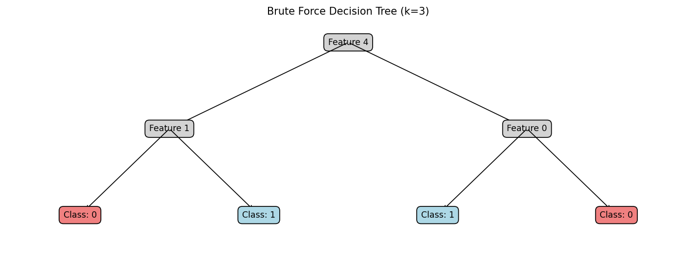

# Decision Tree Implementation

This project implements and compares two decision tree algorithms: an optimized brute-force method and a binary entropy-based method. The implementation is designed to analyze binary classification problems and visualize the resulting decision trees.

## Features

- Optimized brute-force decision tree algorithm
- Binary entropy-based decision tree algorithm
- Performance comparison (success rate and execution time)
- Decision tree visualization

## Requirements

- Python 3.x
- NumPy
- Matplotlib

## Usage

1. Prepare your data in a text file named `vectors.txt`. Each row should represent a data point, with the last column being the binary label (0 or 1).

2. Run the script:

   ```
   python decision_tree.py
   ```

3. The script will output the success rates and execution times for both algorithms and display visualizations of the resulting decision trees.

## Key Findings

1. **Accuracy**: The brute-force method consistently achieves better accuracy than the binary entropy method for any given depth (k).

2. **Execution Time**: The binary entropy method is generally faster than the brute-force method for any given depth (k).

3. **Depth Impact**: Increasing the depth (k) of the decision trees typically leads to improved results for both methods.

## Results

### Execution Time Comparison


This graph shows the execution times for both the brute-force and binary entropy methods across different tree depths (k). As you can see, the binary entropy method consistently executes faster than the brute-force method.

### Success Rate Comparison


This graph compares the success rates of both methods for various tree depths. The brute-force method consistently achieves higher success rates compared to the binary entropy method.

### Decision Trees

#### Brute-Force Method Tree (k=3)

- **Success Rate**: 62.00%
- **Execution Time**: 0.0412 seconds



This is the decision tree generated by the brute-force method with a maximum depth of 3. Note the structure and the feature splits at each node.

#### Binary Entropy Method Tree (k=3)

- **Success Rate**: 57.33%
- **Execution Time**: 0.0106 seconds


This is the decision tree generated by the binary entropy method with a maximum depth of 3. Compare its structure with the brute-force tree to see the differences in feature selection and tree shape.

## Algorithm Descriptions

### Optimized Brute-Force Method

This method exhaustively searches for the best feature to split on at each node of the tree. It uses dynamic programming and caching to optimize performance.

### Binary Entropy Method

This method uses the concept of binary entropy to determine the best feature for splitting at each node. It aims to maximize the information gain at each split.

## Customization

You can modify the `k` value in the main execution block to experiment with different tree depths:

```python
ks = [ 3 ]  # Change this value to adjust the maximum depth of the trees
```

## Visualizations

The script generates visual representations of the decision trees for both methods. These visualizations include:

- The feature used for splitting at each node
- The classification at each leaf node
- The overall success rate and execution time for each method

## Performance Considerations

While the brute-force method generally produces more accurate results, it may become computationally expensive for larger datasets or greater tree depths. The binary entropy method offers a trade-off between accuracy and speed, making it potentially more suitable for larger-scale applications or when quick results are needed.


## Authors
Ron Ashwal <br/>
Zohar Simhon 
